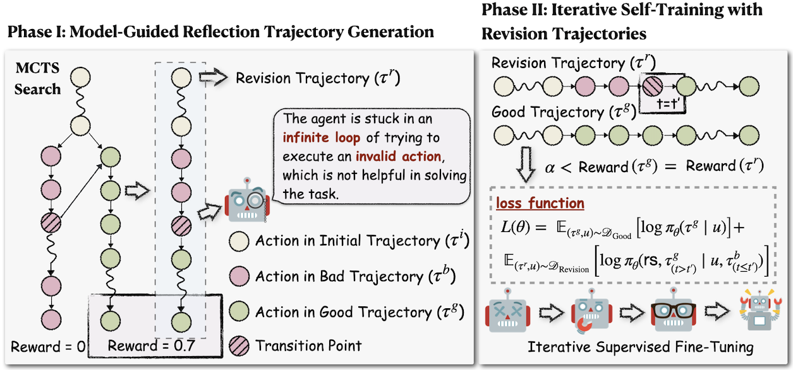

<h1 align="center">Agent-R: Training Language Model Agents to Reflect via Iterative Self-Training</h1>
<p align="center">
[<a href="https://arxiv.org/abs/2501.11425">Paper</a>] 
[<a href="https://github.com/bytedance/Agent-R">Code</a>] 
</p>

## What's New
+  [2025.01.21] We release Agent-R.
   + The paper is available at [Agent-R Paper](https://arxiv.org/abs/2501.11425).
   + The code is available at [Agent-R Code](https://github.com/bytedance/Agent-R).
   
## Introduction
We propose an iterative self-training framework, **Agent-R**, that enables language Agent to Reflect on the fly. Unlike traditional methods that reward or penalize actions solely based on correctness, our approach leverages Monte Carlo Tree Search (MCTS) to construct training samples that recover correct trajectories from erroneous ones. A key challenge of agent task reflection lies in the necessity for timely revision rather than waiting until the end of a rollout to revise errors. To address this, we introduce a model-guided critique construction mechanism: the actor model identifies the first error step (within its current capability) in a failed trajectory. Starting from it, we splice it with the adjacent correct path, which shares the same parent node in the tree. To further explore the scalability of this self-improvement paradigm, we investigate iterative refinement of both error correction capabilities and dataset construction.

<p align="center">
    
</p>

More details are in the paper.

## Repository Structure
- `mcts_collection.py`: Implements the MCTS-based trajectory generation framework.
- `path_collection.py`: Generates revision trajectories based on model-guided evaluation.
- `eval.py`: Script for evaluating the agent's performance across specified tasks.

## Installation
### 1. Clone the Repository
```bash
git clone https://github.com/bytedance/Agent-R.git
cd Agent-R/
```

### 2. Create a Virtual Environment
It is recommended to use a virtual environment to manage dependencies:

#### Using `conda`
```bash
conda create --name agent-r python=3.11 -y
conda activate agent-r
```

### 3. Install Dependencies
Install the required Python packages:
```bash
pip install -r requirements.txt
cd AgentGym/agentenv
pip install -e .
```
## Usage
### Environment Setup
Ensure the `TASK` environment variable is set to one of the supported tasks:
- `webshop`
- `sciworld`
- `textcraft`

Example:
```bash
export TASK=webshop
```

Install [AgentGym](https://github.com/WooooDyy/AgentGym/tree/main) and launch the environment server following the instructions below:

#### WebShop
```bash
# Install dependencies
cd AgentGym/agentenv-webshop
conda env create -n agentenv-webshop -f environment.yml
conda activate agentenv-webshop
bash ./setup.sh

# Launch server
webshop --host 0.0.0.0 --port 36001
```

#### SciWorld
```bash
# Install dependencies
cd AgentGym/agentenv-sciworld
conda create --name agentenv-sciworld python=3.8 -y
conda activate agentenv-sciworld
pip install -e .

# Launch server
sciworld --host 0.0.0.0 --port 36001
```

#### TextCraft
```bash
# Install dependencies
cd AgentGym/agentenv-textcraft
conda create --name agentenv-textcraft python=3.9 -y
conda activate agentenv-textcraft
pip install -e .

# Launch server
textcraft --host 0.0.0.0 --port 36001
```

### Running MCTS-Based Trajectory Generation
To generate trajectories using MCTS, set the necessary environment variables and run the following command:
```bash
export OPENAI_API_KEY=YOUR_OPENAI_API_KEY # Replace with your OpenAI API key If you use OpenAI models
export MAX_DEPTH=YOUR_MAX_DEPTH # Replace with the maximum depth of the MCTS tree
export ITERA=YOUR_ITERA # Replace with the number of iterations for MCTS
export N_GEN=YOUR_N_GEN # Replace with the number of actions to generate per iteration
export MODEL_NAME=YOUR_MODEL_NAME # Replace with the name of the model to use
export MODEL_DIR=YOUR_MODEL_DIR # Replace with the directory where the model is stored
export TASK=YOUR_TASK # Replace with the task name (webshop, sciworld, textcraft)
export TEMP=YOUR_TEMP # Replace with the temperature for the model
export MAX_TOKEN_LENGTH=YOUR_MAX_TOKEN_LENGTH # Replace with the maximum token length for the model
python3 mcts_collection.py \
    --env_server_base "<your_env_server_base>" \
    --model_name "<model_name>" \
    --min <start_index> \
    --max <end_index>
```
- Replace `<model_name>` with the name of the model to use (e.g., `Llama-3.1-8B-Instruct`).
- Use `--min` and `--max` to specify the range of task indices.

### Revision Trajectory Generation
To process paths and generate revised trajectories:
```bash
export OPENAI_API_KEY=YOUR_OPENAI_API_KEY
export MAX_DEPTH=YOUR_MAX_DEPTH
export ITERA=YOUR_ITERA
export N_GEN=YOUR_N_GEN
export MODEL_NAME=YOUR_MODEL_NAME
export MODEL_DIR=YOUR_MODEL_DIR
export TASK=YOUR_TASK
export TEMP=YOUR_TEMP
export MAX_TOKEN_LENGTH=YOUR_MAX_TOKEN_LENGTH # Replace with the maximum token length for the model
export ALPHA=YOUR_ALPHA # the lower bound for high-quality trajectories
export BETA=YOUR_BETA # The distinguishable gap

python3 path_collection.py \
    --input_dir "<input_directory>" \
    --output_dir "<output_directory>" \
    --data_type centric \
    --revise 1
```
- Set `--revise` to `1` to enable on-policy revision.
- Specify directories for input and output data.

### Training with Revision Trajectory Using Xtuner

To train **Llama-3.1-8B-Instruct** with revision trajectory, we utilize **Xtuner**, an efficient tool for distributed training. Follow the steps below to set up and train the model.

#### 1. Set Up the Environment

First, create and activate the virtual environment for Xtuner:

```bash
conda create --name xtuner-env python=3.10 -y
conda activate xtuner-env
pip install -U 'xtuner[deepspeed]'
```

#### 2. Configure the Training Script

Before starting the training process, modify the `llama3_8b_instruct_full_alpaca_e3_copy.py` script with the necessary settings, as outlined in the [Xtuner tutorial](https://github.com/InternLM/xtuner/tree/main/docs/en/user_guides).

#### 3. Start Training

Once the script is configured, run the training using Xtuner by executing the following command:

```bash
conda activate xtuner-env
cd xtuner_config/
NPROC_PER_NODE=${ARNOLD_WORKER_GPU} NNODES=${ARNOLD_WORKER_NUM} PORT=${ARNOLD_WORKER_0_PORT} ADDR=${ARNOLD_WORKER_0_HOST} NODE_RANK=${ARNOLD_ID} xtuner train llama3_8b_instruct_full_alpaca_e3_copy.py --deepspeed deepspeed_zero2
```

Ensure that the environment variables such as `ARNOLD_WORKER_GPU`, `ARNOLD_WORKER_NUM`, `ARNOLD_WORKER_0_PORT`, `ARNOLD_WORKER_0_HOST`, and `ARNOLD_ID` are set according to your distributed setup.


### Evaluating the Agent
To evaluate the agent’s performance on test datasets:
```bash
export OPENAI_API_KEY=YOUR_OPENAI_API_KEY
export MODEL_NAME=YOUR_MODEL_NAME
export MODEL_DIR=YOUR_MODEL_DIR
export MODEL_TYPE=YOUR_MODEL_TYPE # Replace with the type of model (e.g., "Agent-R", "Raw")
export TASK=YOUR_TASK
export TEMP=YOUR_TEMP
export MAX_TOKEN_LENGTH=YOUR_MAX_TOKEN_LENGTH

python3 eval.py \
    --env_server_base "<your_env_server_base>" \
    --model_name "<model_name>" \
    --max_steps <number_of_steps>
```

## License
This project is licensed under the Apache-2.0 License.

## Acknowledgements

We would like to express our gratitude to the following open-source projects that have significantly contributed to the development of this project:

- [xtuner](https://github.com/InternLM/xtuner): Used for training models.
- [AgentGym](https://github.com/WooooDyy/AgentGym): Provided environment server.

Their contributions to the open-source community have been invaluable and greatly appreciated.

## Citation
If you use this code in your research, please cite:
```bibtex
@article{yuan2025agent,
  title={Agent-R: Training Language Model Agents to Reflect via Iterative Self-Training},
  author={Yuan, Siyu and Chen, Zehui and Xi, Zhiheng and Ye, Junjie and Du, Zhengyin and Chen, Jiecao},
  journal={arXiv preprint arXiv:2501.11425},
  year={2025}
}
```
